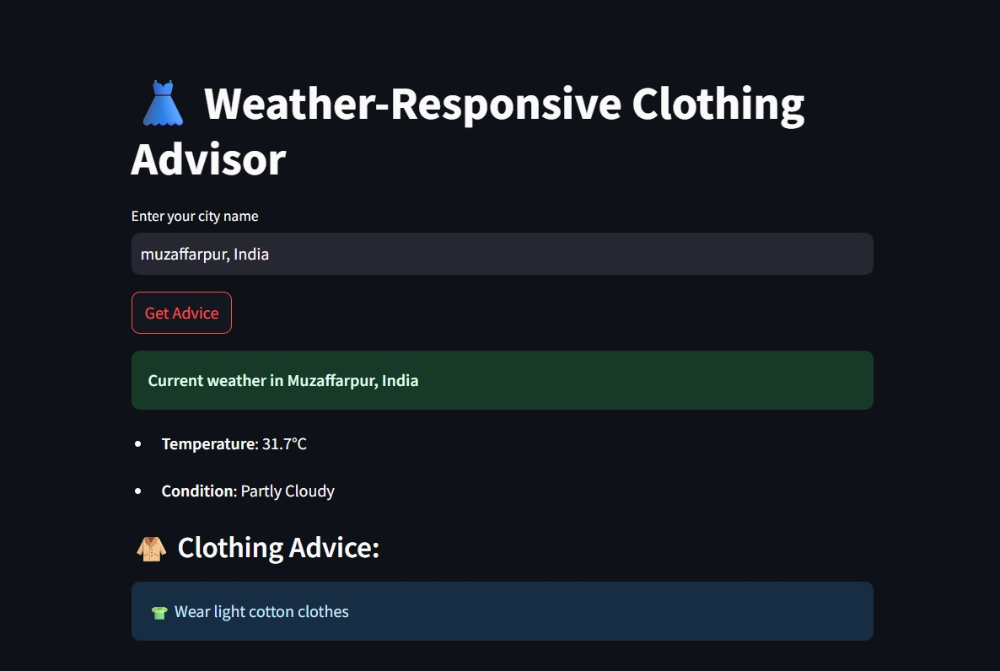

# Weather-Clothing-Advisor

## 🌦 Overview

Weather-Clothing-Advisor is a **Python-based application** that simulates weather data for multiple cities and stores it in a CSV file.
It’s perfect for **testing, data analysis practice, or learning CSV handling in Python** without relying on APIs.

---

## 📂 Project Structure

```
weather-data-generator/
│
├── data/
│   └── weather_data.csv         # Generated weather data
│
├── src/
│   └── generate_weather.py      # Main Python script to generate data
│
├── README.md                    # Project documentation
└── requirements.txt             # Dependencies (if any)
```

---

## ✨ Features

* Generates **random weather data** for cities.
* Saves the output in **CSV format**.
* Includes fields:

  * `City`
  * `Temperature (°C)`
  * `Humidity (%)`
  * `Condition`
  * `Date`
* Easy to modify for your own dataset needs.

---
here's the look of project



## 🚀 Getting Started

### 1️⃣ Prerequisites

* **Python 3.8+** installed
* Basic knowledge of running Python scripts

---

### 2️⃣ Installation

Clone the repository:

```
git clone https://github.com/sanyagupta31/weather-clothing-advisor.git
cd weather-clothing-advisor
```

---

### 3️⃣ Usage

Run the Python script to generate the CSV:

```
python src/generate_weather.py
```

Output will be saved in:

```
data/weather_data.csv
```

---

## 📊 Example CSV Output

| City      | Temperature (°C) | Humidity (%) | Condition | Date       |
| --------- | ---------------- | ------------ | --------- | ---------- |
| Delhi     | 32               | 60           | Sunny     | 2025-08-08 |
| Mumbai    | 28               | 75           | Rainy     | 2025-08-08 |
| Bangalore | 26               | 68           | Cloudy    | 2025-08-08 |

---

## 🛠 Technologies Used

* **Python** – for generating random data
* **CSV Module** – for file handling

---

## 💡 Future Enhancements

* Integrate with **Weather API** for real data
* Add **graph visualizations** for temperature trends
* Create a **GUI interface** for easier use

---

## 👩‍💻 Author

**Sanya Gupta**


---

